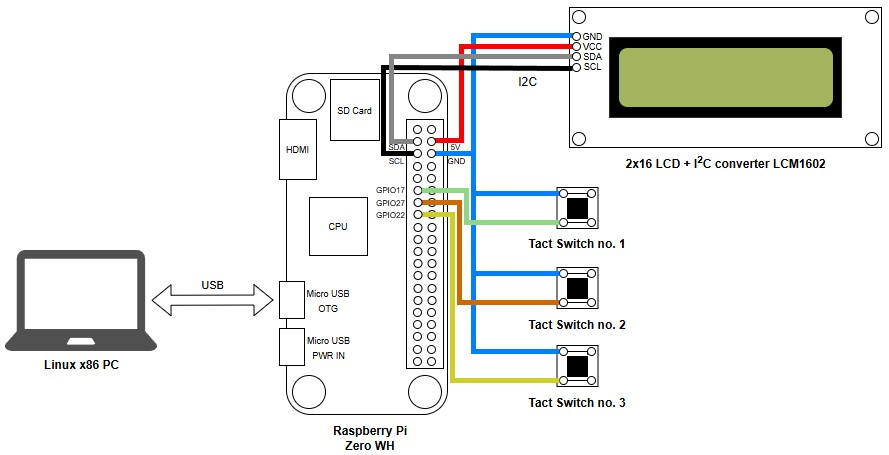
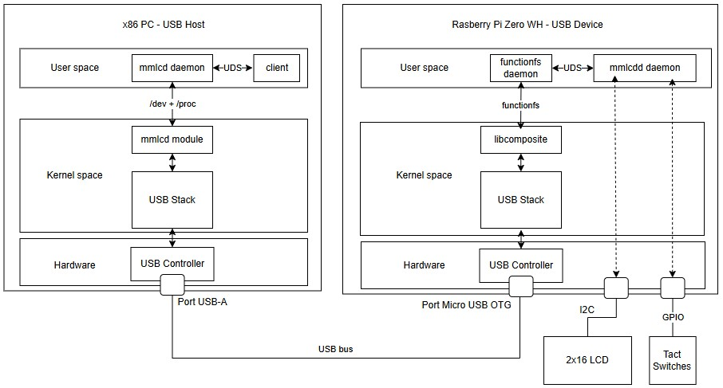

# mmlcd

A simple USB device with 2x16 LCD and Tact Switches on Raspberry PI.

This repository contains implementation of Linux USB drivers for a custom USB device - both the USB Device Driver (running on the USB host) and the USB Gadget Driver (running on the USB device). Additionally, it includes implementation of a helper library and a simple CLI tool that utilizes functionalities provided by the drivers. 

## Goal

This project was created as part of my master thesis in computer science. The goal was to present and compare various methods of USB device drivers implementation in the Linux operating system. This project can be useful as a starting point for anybody interested in learning about Linux USB drivers, because it provides a fairly simple example system, that can be easily understood by somebody without extensive knowledge in the Linux kernel internals.  

## Hardware setup

The original hardware setup for this project is based on a Raspberry Pi Zero WH acting as a USB device, which is connected to a x86 Linux PC acting as a USB host. The Raspberry Pi is extended with 3 tact switches and a 2x16 LCD connected through a LCM1602 I2C converter.

## Software architecture

The system is decomposed into following key components:
- mmlcd daemon - A user space daemon process running on both the USB host and USB device. It is responsible for processing of user commands directed to the LCD and reading of the tact switches state. It provides a UDS socket for communication with client user space programs. Communication with the peripherals is done through a Hardware Abstraction Layer (HAL), that is utilizing the USB Device Driver on the host side, and I2C / GPIO on the device side.
- mmlcd kernel module - A kernel module acting as a USB Device Driver running on the USB host. It is utilizing the Linux USB sub-system for implementation of a communication protocol with the custom USB device. It provides interfaces for user space programs through devfs and procfs.
- functionfs daemon - A user space daemon process running on the USB device side. It is responsible for handling of the functionfs virtual filesystem utilized for implementation of custom USB Gadget features on the USB device side. This approach is possible thanks to the libcomposite kernel module, which enables configuration of USB Gadgets through the configfs virtual filesystem.
- libmmlcd - A helper library providing a simple set of functions for control over the LCD and tact switches. It internally implements communication with the mmlcd daemon through the UDS socket. 
- mmlcdctl - A CLI tool for control over the LCD and tact switches. It internally uses the libmmlcd. 

